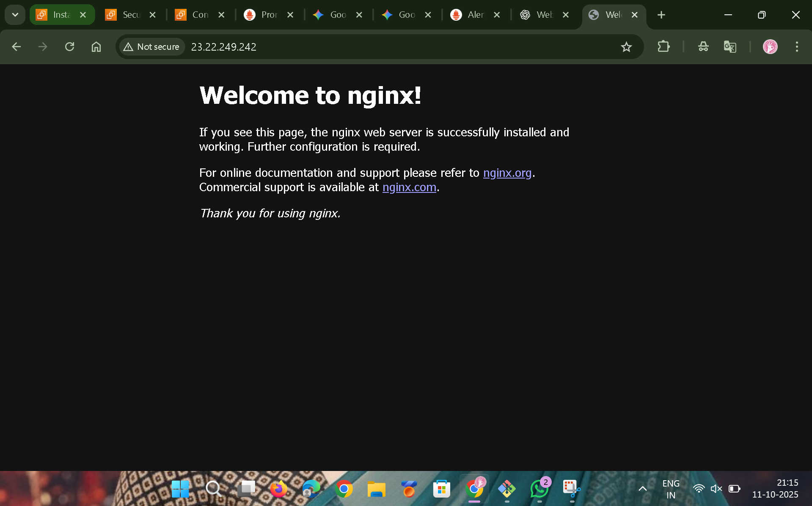

# 🛠️ Self-Healing Infrastructure with Prometheus, Alertmanager & Ansible

This project demonstrates a **closed-loop, self-healing infrastructure** on AWS using **Prometheus**, **Alertmanager**, and **Ansible**.  
It automatically detects and recovers from service failures — for example, restarting a crashed Nginx server without manual intervention.

---

## 🚀 Project Objective

To build a system that can **automatically detect a service failure** (like Nginx going down) and **trigger an automated recovery** process using Ansible.  
This reduces downtime and improves system reliability.

---

## 🏗️ Architecture

### The system operates on two EC2 instances:

**1️⃣ Monitoring Server (Control Node)**  
- **Prometheus:** Scrapes metrics from the web server  
- **Alertmanager:** Receives alerts from Prometheus  
- **Ansible:** Executes automated recovery playbooks  
- **Webhook Receiver (Flask):** Triggers Ansible playbook when alert fires  

**2️⃣ Web Server (Managed Node)**  
- **Nginx:** Target service being monitored  
- **Node Exporter:** Exposes metrics to Prometheus  

---

## ⚙️ Self-Healing Flow

1. **Failure:** Nginx service stops on the web server  
2. **Detection:** Prometheus detects `up == 0` from Node Exporter  
3. **Alerting:** Prometheus fires `InstanceDown` alert to Alertmanager  
4. **Trigger:** Alertmanager sends alert (JSON) to Flask webhook  
5. **Action:** Webhook triggers `restart_nginx.yml` Ansible playbook  
6. **Recovery:** Ansible restarts Nginx service  
7. **Resolution:** Prometheus confirms service restored, alert resolves  

---

## 🧰 Tools Used

| Tool | Purpose |
|------|----------|
| **AWS EC2 (Amazon Linux 2)** | Compute Instances |
| **Prometheus** | Monitoring |
| **Alertmanager** | Alerting |
| **Ansible** | Automation |
| **Node Exporter** | Metrics Collection |
| **Python (Flask)** | Webhook Receiver |
| **Nginx** | Web Service |
| **systemd** | Service Management |

---


---

## 📖 Step-by-Step Setup Guide

### 🧩 Prerequisites

#### EC2 Instances
- `monitoring-server`
- `web-server`


#### User & SSH Setup
- Create `ansible` user on both servers
- Configure passwordless SSH from monitoring-server → web-server
- Add passwordless sudo for ansible:
  ```
  ansible ALL=(ALL) NOPASSWD: ALL
  ```

#### Security Groups
- **Web Server:** Ports `80`, `9100` (from monitoring-server)
- **Monitoring Server:** Ports `9090`, `9093`, `3000` (optional Grafana)

---

## 🖥️ Step 1: Configure Web Server (Managed Node)

### Install Nginx
```bash
sudo dnf update -y
sudo dnf install nginx -y
sudo systemctl start nginx
sudo systemctl enable nginx
sudo systemctl status nginx
```

### Install Node Exporter
```bash
wget https://github.com/prometheus/node_exporter/releases/download/v1.7.0/node_exporter-1.7.0.linux-amd64.tar.gz
tar xvf node_exporter-1.7.0.linux-amd64.tar.gz
sudo mv node_exporter-1.7.0.linux-amd64/node_exporter /usr/local/bin/
rm -rf node_exporter*
```

### Create Service File
`/etc/systemd/system/node_exporter.service`
```
[Unit]
Description=Prometheus Node Exporter
Wants=network-online.target
After=network-online.target

[Service]
User=ansible
ExecStart=/usr/local/bin/node_exporter

[Install]
WantedBy=default.target
```

Enable Service:
```bash
sudo systemctl daemon-reload
sudo systemctl start node_exporter
sudo systemctl enable node_exporter
```

---

## 🧠 Step 2: Install Prometheus & Alertmanager (Monitoring Server)

### Install Prometheus
```bash
wget https://github.com/prometheus/prometheus/releases/download/v2.51.2/prometheus-2.51.2.linux-amd64.tar.gz
tar xvf prometheus-2.51.2.linux-amd64.tar.gz
sudo useradd --no-create-home --shell /bin/false prometheus
sudo mkdir /etc/prometheus /var/lib/prometheus
sudo mv prometheus-2.51.2.linux-amd64/{prometheus,promtool} /usr/local/bin/
sudo mv prometheus-2.51.2.linux-amd64/{consoles,console_libraries} /etc/prometheus/
sudo chown -R prometheus:prometheus /etc/prometheus /var/lib/prometheus
rm -rf prometheus*
```

### Install Alertmanager
```bash
wget https://github.com/prometheus/alertmanager/releases/download/v0.27.0/alertmanager-0.27.0.linux-amd64.tar.gz
tar xvf alertmanager-0.27.0.linux-amd64.tar.gz
sudo useradd --no-create-home --shell /bin/false alertmanager
sudo mkdir /etc/alertmanager
sudo mv alertmanager-0.27.0.linux-amd64/{alertmanager,amtool} /usr/local/bin/
sudo chown -R alertmanager:alertmanager /etc/alertmanager
rm -rf alertmanager*
```

---

## ⚙️ Step 3: Prometheus Configuration

**`/etc/prometheus/prometheus.yml`**
```yaml
global:
  scrape_interval: 10s

rule_files:
  - "/etc/prometheus/alert.rules.yml"

alerting:
  alertmanagers:
    - static_configs:
        - targets: ['localhost:9093']

scrape_configs:
  - job_name: 'prometheus'
    static_configs:
      - targets: ['localhost:9090']

  - job_name: 'nginx'
    static_configs:
      - targets: ['<web-server-private-ip>:9113']

  - job_name: 'node_exporter_web_server'
    static_configs:
      - targets: ['<web-server-private-ip>:9100']
```

**`/etc/prometheus/alert.rules.yml`**
```yaml
groups:
  - name: InstanceDown
    rules:
      - alert: InstanceDown
        expr: up == 0
        for: 1m
        labels:
          severity: 'critical'
        annotations:
          summary: 'Instance {{ $labels.instance }} down'
          description: '{{ $labels.instance }} of job {{ $labels.job }} has been down for more than 1 minute.'

      - alert: HighCpuUsage
        expr: 100 - (avg by (instance) (rate(node_cpu_seconds_total{mode="idle"}[2m])) * 100) > 90
        for: 2m
        labels:
          severity: 'warning'
        annotations:
          summary: 'High CPU usage on {{ $labels.instance }}'
          description: '{{ $labels.instance }} has had CPU usage above 90% for more than 2 minutes.'

      - alert: NginxDown
        expr: nginx_up{job="nginx"} == 0
        for: 1m
        labels:
          severity: "critical"
        annotations:
          summary: "Nginx is down on {{ $labels.instance }}"
          description: "The Nginx service is not responding. Ansible restart required."
```

---

## ⚡ Step 4: Alertmanager Configuration

**`/etc/alertmanager/alertmanager.yml`**
```yaml
global:
  resolve_timeout: 5m

route:
  receiver: 'ansible-webhook'

receivers:
  - name: 'ansible-webhook'
    webhook_configs:
      - url: 'http://localhost:5001/'
        send_resolved: true
```

---

## 🤖 Step 5: Ansible Setup

**`~/ansible/inventory`**
```
[webs-erver]
<WEB_SERVER_PRIVATE_IP>
```

**`~/ansible/restart_nginx.yml`**
```yaml
---
- name: Install and Configure Nginx
  hosts: webservers
  become: yes  # This is the equivalent of using 'sudo'

  tasks:
    - name: Install Nginx for Amazon Linux 2
      # This uses the 'amazon-linux-extras' command
      community.general.amazon_linux_extras:
        name: nginx1
        state: present
      when: ansible_distribution == 'Amazon' and ansible_distribution_major_version == '2'

    - name: Install Nginx for Amazon Linux 2023
      # This uses the modern 'dnf' package manager
      ansible.builtin.dnf:
        name: nginx
        state: present
      when: ansible_distribution == 'Amazon' and ansible_distribution_major_version == '2023'

    - name: Ensure Nginx service is started and enabled on boot
      ansible.builtin.service:
        name: nginx
        state: started
        enabled: yes
```

Test:
```bash
ansible-playbook -i inventory restart_nginx.yml
```

---

## 🧩 Step 6: Webhook Receiver

**Install Flask**
```bash
sudo yum install python3-pip -y
pip3 install flask --user
```

**`~/webhook_receiver.py`**
```python
from flask import Flask, request
import subprocess
import json

app = Flask(__name__)

@app.route('/webhook', methods=['POST'])
def webhook():
    if request.method == 'POST':
        try:
            data = json.loads(request.data)
            print("Alert received!")
            print(json.dumps(data, indent=2))

            # Match your alert name and status
            if data['status'] == 'firing' and data['alerts'][0]['labels']['alertname'] == 'NginxDown':
                print("NginxDown alert firing. Triggering Ansible playbook...")

                # Full absolute paths
                playbook_path = '/home/ansible/ansible/restart_nginx.yml'
                inventory_path = '/home/ansible/ansible/inventory'
                private_key_path = '/home/ansible/.ssh/ansible_key'
                ansible_path = '/home/ansible/.local/bin/ansible-playbook'

                # Execute the playbook
                process = subprocess.Popen(
                    [ansible_path, '-i', inventory_path, '--private-key', private_key_path, playbook_path],
                    cwd='/home/ansible',
                    stdout=subprocess.PIPE,
                    stderr=subprocess.PIPE,
                    text=True
                )
                stdout, stderr = process.communicate()
```

---

## 🧾 Step 7: Service Files (in `/services/`)

### 🔹 `prometheus.service`
```
[Unit]
Description=Prometheus Monitoring
After=network-online.target

[Service]
User=prometheus
ExecStart=/usr/local/bin/prometheus \
  --config.file /etc/prometheus/prometheus.yml \
  --storage.tsdb.path /var/lib/prometheus/ \
  --web.console.templates=/etc/prometheus/consoles \
  --web.console.libraries=/etc/prometheus/console_libraries

[Install]
WantedBy=multi-user.target
```

### 🔹 `alertmanager.service`
```
[Unit]
Description=Prometheus Alertmanager
After=network-online.target

[Service]
User=alertmanager
ExecStart=/usr/local/bin/alertmanager \
  --config.file /etc/alertmanager/alertmanager.yml

[Install]
WantedBy=multi-user.target
```

### 🔹 `webhook.service`
```
[Unit]
Description=Ansible Webhook Receiver
After=network.target

[Service]
User=ansible
ExecStart=/usr/bin/python3 /home/ansible/webhook_receiver.py
Restart=always

[Install]
WantedBy=multi-user.target
```

### 🔹 `node_exporter.service`
```
[Unit]
Description=Prometheus Node Exporter
After=network-online.target

[Service]
User=ansible
ExecStart=/usr/local/bin/node_exporter

[Install]
WantedBy=default.target
```

Enable and Start All:
```bash
sudo systemctl daemon-reload
sudo systemctl enable prometheus alertmanager webhook node_exporter
sudo systemctl start prometheus alertmanager webhook node_exporter
```

---

## ✅ Step 8: Testing the Self-Healing System

1. **Prometheus UI:**  
   http://<monitoring-server-ip>:9090 → “Targets” → Node Exporter = UP
   

   
2. **Simulate Failure (on web-server):**
   ```bash
   sudo systemctl stop nginx
   sudo systemctl stop node_exporter
   ```
   
   - Prometheus UI
   
   - alertmanager UI
   
   - nginx UI
   
3. **Prometheus alert → Alertmanager → Webhook → Ansible → Nginx auto-restarts**
   - Prometheus detects the failure. Prometheus sends the alert to Alertmanager
   - Alertmanager immeditately forwards it to the webhook at http://127.0.0.1:5001/webhook.
   - webhook received the alert and successfully executed the Ansible playbook.
   


   
5. **Watch Webhook Logs:**
   ```bash
   journalctl -u webhook -f
   ```
6. **Expected Output:**
   ```
   InstanceDown alert received! Triggering Ansible playbook...
   PLAY [Restart Nginx Service] ...
   ```
7. **Verify:**
   ```bash
   systemctl status nginx
   ```
   Should show **active (running)** again.

   
   - nginx running successfully automaticatly
   
   
---

## 🧯 Troubleshooting

- Check if alert fires in Prometheus & Alertmanager UIs  
- Use:
  ```bash
  journalctl -u webhook -f
  ```
- Manually test Ansible if automation fails  

---


